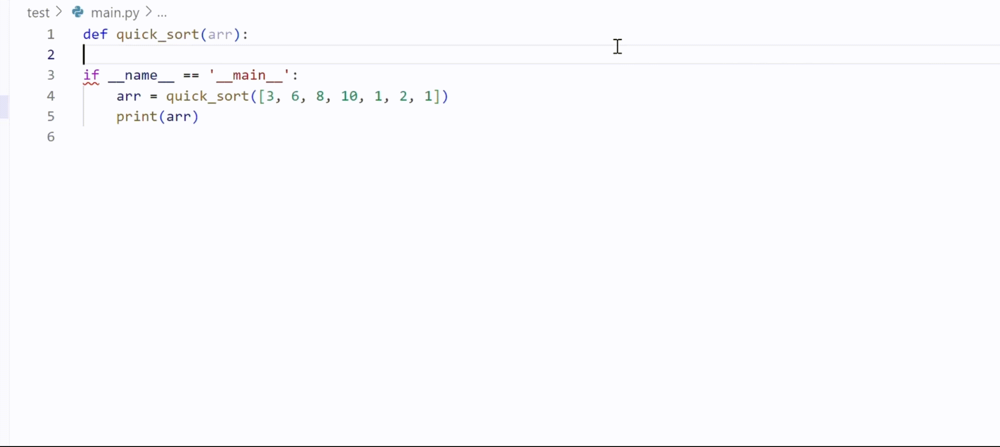

<!-- markdownlint-disable first-line-h1 -->
<!-- markdownlint-disable html -->
<!-- markdownlint-disable no-duplicate-header -->

<div align="center">
  
</div>
<hr>
<div align="center" style="line-height: 1;">
  <!-- <a href="" target="_blank" style="margin: 2px;">
    
  </a> -->
<!--   <a href="" target="_blank" style="margin: 2px;">
    
  </a> -->
  <a href="" target="_blank" style="margin: 2px;">
    
  </a>
  <a href="https://github.com/HIT-SCIR/Abacus/blob/main/LICENSE" style="margin: 2px;">
  
  </a>
</div>


---

- [引言](#1引言)
- [模型下载](#2模型下载)
- [模型评价](#3模型评价)
- [训练过程](#4训练过程)
- [模型使用](#5模型使用)
- [微调适配平台](#6微调适配平台)
- [VSCode插件](#7VSCode插件)

## 1.引言 
​从DeepMind发布的AlphaCode在竞赛级编程能力上超越人类平均水平之日起，代码大模型便广受关注。与此同时，OpenAI发布的CodeX更是展示出了代码大模型具有超越传统编程范畴的数值推理、逻辑推断、工具调用等高阶能力，进一步引爆了对该领域的研究与讨论。以BigCode StarCoder为代表的开源项目对完善该领域的研究生态做出了卓越的贡献。然而，目前开源代码大模型提升编程能力的同时会严重损害通用语言能力。为此，哈尔滨工业大学社会计算与信息检索研究中心（HIT-SCIR）推出了<strong>“珠算”代码大模型</strong>，其以2.7B参数在**代码与通用语言平均性能上**均超越了DeepSeek-Coder-1.3B、Yi-Coder-1.5B、Stable Code-3B、Granite-3B-Code等参数量3B及以下的代码大模型，希望通过**开放权重、训练细节以及配套的微调适配平台与插件**，助力开源社区的发展。
<p align="center">
  
</p>

- 珠算大模型在国内外3B量级代码大模型中具有最优的代码和通用语言能力。
- 基于珠算大模型的编程辅助工具可以在VSCode内一键安装，支持代码生成与补全等应用。

## 2.模型下载


<div align="center">

|模型名称|文件大小|下载地址|备注|
|:---:|:---:|:---:|:---:|
|Abacus|5GB|[🤗HuggingFace](https://huggingface.co/HIT-SCIR/Abacus)<br>[ModelScope](https://www.modelscope.cn/models/HIT-SCIR/Abacus)|Abacus完整模型|
|Abacus-gguf|1.7GB(Q4_K_M)<br>2.7GB(Q8_0)|[🤗HuggingFace](https://huggingface.co/HIT-SCIR/Abacus-gguf)<br>[ModelScope](https://www.modelscope.cn/models/HIT-SCIR/Abacus-gguf)|珠算GGUF版本，适用于llama.cpp、Ollama等推理框架|

</div>


## 3.模型评价
#### 代码生成能力
模型代码生成能力的评估主要基于以下评测基准：
- HumanEval：由 164 道原创编程题组成的评测基准，通过衡量从文档字符串生成程序的功能正确性，评估语言理解、算法和简单的数学能力。
- HumanEval+：HumanEval+将原始HumanEval中164道问题的单元测试的规模增加了80倍，用于严格评估 LLM 生成代码的功能正确性。
- MBPP(sanitized)：Python编程任务评测基准，经过人工验证后的MBPP子集，删减修改了原始MBPP中描述模糊、错误、不符合正常习惯的问题。
- MBPP+：精简了原始MBPP中的问题数量，并将单元测试的规模增加35倍，用于严格评估 LLM 生成代码的功能正确性。
- LiveCodeBench：旨在为 LLM 提供全面、公平的竞赛编程评估。 通过持续收集LeetCode、AtCoder和CodeForces竞赛平台的新问题，形成了动态的综合基准库。 为了确保数据不受污染，我们选择了 2024 年 1 月至 9 月的问题进行测试。
<div align="center">

| 模型名称                         | HumanEval | HumanEval+ | MBPP(sanitized) | MBPP+ | LiveCodeBench | AVG   |
|:----------------------------------:|:-----------:|:------------:|:-----------------:|:-------:|:----------------:|:-------|
| Granite-3B-Code-Instruct          | 45.73     | 39.63      | 53.70           | 41.10 | 7.46           | 37.52 |
| Stable-Code-Instruct-3B           | 67.07     | 56.71      | 57.20           | 37.59 | **11.43**          | 46.00 |
| Yi-Coder-1.5B-Chat                | 67.68     | 60.37      | **61.87**          | **48.37** | 8.22           | 49.30 |
| DeepSeek-Coder-1.3B-Instruct      | 65.24     | 59.15      | 56.03           | 45.36 | 7.00           | 46.56 |
| 珠算                              | **71.95**    | **65.85**      | 57.98           | 43.36 | 9.06           | **49.64** |
</div>

**在国内外3B以下代码大模型中，珠算大模型在五个主流代码评测基准上的综合表现达到最佳**，各项指标均处于领先水平。其中，在Humaneval和Humaneval+基准上的表现尤为突出；在MBPP(sanitized)和MBPP+基准上的表现略逊于最新发布的Yi-Coder-1.5B-chat；而在LiveCodeBench基准上的表现仅次于Stable-Code-Instruct-3B。

#### 3.2 通用语言能力
通用语言能力的评估主要基于以下评测基准：
- MMLU：包含57个多选任务的英文评测基准，涵盖初等数学、美国历史、计算机科学、法律等，难度覆盖高中水平到专家水平，是目前主流的LLM评测基准之一。
- HellaSwag：极具挑战的英文NLI评测基准，需要对上下文进行深入理解，无法基于常识直接回答。
- ARC-e：多项选择题的问答评测基准，包含了从三年级到九年级的科学考试题目。ARC-e(easy) 是其中的一个简单难度测试子集。
- BBH(BIG-Bench Hard)：BIG-Bench 是一个用于评估语言模型的多样化的数据集。BBH 专注于从 BIG-Bench 中挑选出的23个具有挑战性的任务。
- C-Eval：全面的中文LLM评估基准，包含了13,948个多项选择题，涵盖了52个不同的学科和四个难度级别。
- CMMLU：综合性中文评估基准，用于评估语言模型在中文语境下的知识和推理能力，涵盖了从基础学科到高级专业水平的67个主题。
- GSM8K：高质量小学数学应用题评测基准，需要2到8个步骤来解决，解决方案主要涉及基本算术运算，可用于评价多步数学推理能力。
<div align="center">
  

| 模型名称                       | MMLU  | HellaSwag | ARC-e | BBH   | C-Eval | CMMLU  | GSM8K | AVG   |
|:-------------------------------:|:-------:|:-----------:|:---------:|:--------:|:---------:|:--------:|:--------:|:--------:|
| Granite-3B-Code-Instruct       | 29.95 | 26.82     | 47.62 | 35.87 | 32.30  | 30.77 | **56.48** | 37.12 |
| Stable-Code-Instruct-3B        | 29.34 | 32.15     | 34.74 | 21.69 | 28.61  | 29.18 | 15.92 | 27.37 |
| Yi-Coder-1.5B-Chat             | 33.98 | 28.52     | 40.04 | 34.40 | 31.88  | 31.88 | 10.16 | 30.12 |
| DeepSeek-Coder-1.3B-Instruct   | 26.68 | 25.25     | 27.69 | 7.48  | 25.61  | 26.88 | 9.63  | 21.32 |
| 珠算                          | **40.18** | **53.23**     | **66.67** | **36.08** | **36.00**  | **36.84** | 46.32 | **45.05** |

</div>

**在国内外3B以下代码大模型中，珠算大模型在七个主流通用语言评测基准上的综合表现达到最佳**，且具有明显优势。除在数学推理GSM8K基准上低于Granite-3B-Code-Instruct，其余各项指标均达到最优；通用语言能力与通用大模型MiniCPM-2B-sft-bf16还有一定差距，后续版本将对此进行强化，以此带来更自然、更流畅的对话，以及对用户需求更充分的理解，最终在自动化编程辅助、代码智能体领域有更加广阔的应用前景。

## 4.训练过程
#### 预训练数据处理
- 代码数据：
  - step1: 借助抽象语法树（AST）分析代码的结构，**去除存在低级语法错误与包含过时语法特性**（如print “Hello World”，Python3解释器已不再支持）的代码.
  - step2: 提取了**数据密集型代码**(例如base64格式编码或长字符串）和**简单重复代码**的特征并设计了正则表达式进行了针对性的过滤。
  - step3: 利用静态代码分析工具Ruff提供的漏洞检测与修复功能，**去除了含有未定义变量错误的代码、修复了剩余代码的常见规范性错误**（如多余的空行、空格）。
  - step4: 使用**代码依赖分析**按代码的逻辑结构合理地组织数据训练顺序。

<p align="center">
  
</p>

- 通用语言数据：
  - step1: 在**StackExchange数据**中使用Llama3.1-70B-Chat对随机采样的2万个样本进行评分并使用评分结果训练了质量评估模型（准确率与召回率达95%），然后利用该模型对完整数据进行过滤。
  - step2: 从数据集中筛选出了Markdown与reStructureText格式的**技术文档**，这些格式的文件常为项目的说明文档或技术文档。然后，从中过滤出语言为中英文、包含Python代码块的文件。

#### 预训练策略
- 我们从MiniCPM-2B退火前的最后一个检查点开始继续预训练。学习率调度参照了WSD方法，即Warmup至一个较高的恒定学习率（称之为Stable阶段），用以搜索全局最优点，最后结合微调数据快速线性退火收敛至较低损失。其中，Stable阶段的恒定学习率设计主要为了便于随时接入新数据。在珠算大模型**数据确定的场景下，我们观测到在该阶段缓慢降低学习率更有利于预训练数据的充分学习**，因此应用了cosine学习率调度进行替换，形成WCL学习率调度（Warmup-Cosine-Linear）。学习率曲线如下图所示。
<p align="center">
  
</p>

- 预训练数据组成：
  - Cosine Decay阶段的预训练数据由70%的代码数据、10%数学相关数据、20%的通用语言数据组成，共95B token。
  - Linear Decay阶段预训练与微调数据比例为8:2，预训练内部组成与Cosine阶段保持一致，微调内部代码与通用语言数据的比例为1:1，共7B token。
- 珠算大模型将packing策略（即将不同长度的样本拼接后整体作为一条训练数据）优化为了**Block Attention Mask**，将训练数据内部每个样本的注意力机制范围限制在自身，避免了样本间的污染，如下图所示。

<p align="center">
  
</p>

#### 面向代码的微调
- 微调数据处理：我们提出了Semi-Instruct，结合了Natural-Instruct（自动收集）和Self-Instruct（模型合成）两种方式。首先，通过类似Self-Instruct的方法，修复Natural-Instruct代码的规范性问题并补充缺失的指令。同时，生成测试用例的输入，利用原始代码的正确性，执行原始代码获得输出。然后，利用完整的测试样例验证新代码的**正确性**。最终，为去除不同来源的数据之间的重复样本，我们借助基于句子嵌入的SemDeDup方法对数据整体进行了深层语义去重，确保了微调数据的**多样性**。
- 微调策略：为充分激发模型预训练阶段习得的能力，微调阶段的数据配比与超参数设置训练尽可能地与预训练退火阶段保持了对齐，以减小两者之间的差距。具体而言，微调数据量约80万条，共训练3个epoch。**学习率（1.6e-4）、数据配比与退火阶段保持一致**。数据来源上，Code数据主要来自一些高质量的开源Code数据，NL数据我们则使用了Infinity-Instruct-7M数据中的Math、Commonsense和Subjective3个类别的数据。## 1.模型介绍


- 预训练数据组成：
  - Cosine Decay阶段的预训练数据由70%的代码数据、10%数学相关数据、20%的通用语言数据组成，共95B token。
  - Linear Decay阶段预训练与微调数据比例为8:2，预训练内部组成与Cosine阶段保持一致，微调内部代码与通用语言数据的比例为1:1，共7B token。
- 珠算大模型将packing策略（即将不同长度的样本拼接后整体作为一条训练数据）优化为了**Block Attention Mask**，将训练数据内部每个样本的注意力机制范围限制在自身，避免了样本间的污染，如下图所示。


## 5.模型使用
#### Quick Start
[下载Ollama](https://github.com/ollama/ollama/blob/main/README.md)并启动Ollama service：
```bash
ollama serve
```
运行珠算大模型：
```bash
ollama run HIT-SCIR/abacus
```
#### Transformers 模型推理 + 流式生成

<details>

transformers支持为tokenizer添加聊天模板，并支持流式生成。示例代码如下：
```python
# example/transformers-stream/stream.py

import torch
from transformers import AutoModelForCausalLM, AutoTokenizer, TextStreamer

model_id = "HIT-SCIR/abacus"

tokenizer = AutoTokenizer.from_pretrained(model_id)
model = AutoModelForCausalLM.from_pretrained(
    model_id,
    torch_dtype=torch.bfloat16,
    device_map="auto",
    trust_remote_code=True,
)

chat = [
    {"role": "user", "content": "请你用python写一段快速排序的代码"},
]

inputs = tokenizer.apply_chat_template(
    chat,
    tokenize=True,
    add_generation_prompt=True,
    return_tensors="pt",
).to(0)

stream_output = model.generate(
    inputs,
    streamer=TextStreamer(tokenizer, skip_prompt=True, skip_special_tokens=True),
    temperature=0.8,
    top_p=0.9,
    max_new_tokens=2048,
)
```
</details>

#### ModelScope 模型推理
<details>
  
ModelScope的接口与Transformers非常相似，只需将transformers替换为modelscope即可：
```python
# example/modelscope-generate/generate.py

import torch
from modelscope import AutoTokenizer, AutoModelForCausalLM

model_id = "HIT-SCIR/abacus"

tokenizer = AutoTokenizer.from_pretrained(model_id)
model = AutoModelForCausalLM.from_pretrained(
    model_id,
    torch_dtype=torch.bfloat16,
    device_map="auto",
    trust_remote_code=True,
)

text = "<用户>请你用python写一段快速排序的代码<AI>"

inputs = tokenizer(text, return_tensors="pt").to(0)
outputs = model.generate(
    **inputs,
    temperature=0.8,
    top_p=0.9,
    max_new_tokens=2048,
)
print(tokenizer.decode(outputs[0], skip_special_tokens=False))
```

</details>

#### vLLM 推理加速

<details>
  
珠算支持通过vLLM实现推理加速，示例代码如下：
```python
# example/vllm-generate/generate.py

from vllm import LLM, SamplingParams

llm = LLM(
    model="HIT-SCIR/abacus",
    tensor_parallel_size=1,
    trust_remote_code=True,
)

sampling_params = SamplingParams(
    temperature=0.8, top_p=0.95, max_tokens=2048
)

prompts = [
    "<用户>请你用python写一段快速排序的代码<AI>",
]

outputs = llm.generate(prompts, sampling_params)

for output in outputs:
    prompt = output.prompt
    generated_text = output.outputs[0].text
    print(generated_text)
```

</details>

#### llama.cpp部署

<details>
  
GGUF格式旨在快速加载和保存模型，由llama.cpp团队推出，适用于llama.cpp、Ollama等框架。您可以手动将HuggingFace格式的珠算转换到GGUF格式。下面介绍使用llama.cpp转GGUF的方法和部署步骤。

##### Step 1 环境准备
首先需要下载llama.cpp的源码。
```bash
git clone https://github.com/ggerganov/llama.cpp.git
cd llama.cpp
```
然后需要进行编译，推荐使用`cmake`。根据您的硬件平台，编译命令有细微差异：
```bash
# cpu
cmake -B build_cpu
cmake --build build_cpu --config Release

# cuda
cmake -B build_cuda -DGGML_CUDA=ON
cmake --build build_cuda --config Release -j 12
```

##### Step 2 格式转换（可选）
以下命令需要在`llama.cpp/`目录下：
转换为GGUF格式
```bash
python convert.py --outfile /path/to/Abacus.gguf /path/to/Abacus
```
进行GGUF格式的Q4_K_M量化，以下命令需要在`llama.cpp/build_cpu/bin`或者`llama.cpp/build_cuda/bin`目录下(依赖于编译的平台)：
```bash
./llama-quantize /path/to/Abacus.gguf /path/to/Abacus-Q4_K_M.gguf Q4_K_M
```
##### Step 3 开始推理
以下命令需要在`llama.cpp/build_cpu/bin`或者`llama.cpp/build_cuda/bin`目录下(依赖于编译的平台)：
```bash
./llama-cli -m /path/to/Abacus.gguf -p "<用户>帮我写一个快速排序代码<AI>" -n 128
```
关于`main`的更多参数，可以参考llama.cpp的[官方文档](https://github.com/ggerganov/llama.cpp/blob/master/examples/main/README.md)。

</details>

#### Ollama部署
<details>
  
GGUF格式模型同样可以使用Ollama部署。下面介绍简要步骤。
##### Step 1 环境准备
这里使用仓库release的压缩包来免root安装，更多安装方法可以参考Ollama官方的[安装教程](https://github.com/ollama/ollama/blob/main/README.md)。
```bash
wget https://github.com/ollama/ollama/releases/download/v0.3.10/ollama-linux-amd64.tgz
tar -C /path/to/ollama -xzf /path/to/ollama-linux-amd64.tgz
```
##### Step 2 导入模型
```bash
cd /path/to/ollama/bin
```
构建`Modelfile`，指定导入GGUF模型路径，其内容示例如下，更多参数设置可参考[官方文档](https://github.com/ggerganov/llama.cpp/blob/master/examples/main/README.md)。
```bash
FROM /path/to/Abacus.gguf
```
Ollama创建模型
```bash
./ollama create Abacus -f path/to/Modelfile
```
##### Step 3 使用模型
同样在`path/to/ollama/bin`路径下：
```bash
./ollama run Abacus
>>> <用户>帮我写一个快速排序代码<AI>
```

</details>

## 6.微调适配平台
#### 模型微调功能
<p align="center">
  
</p>
<p align="center">
  
</p>

#### 模型评估功能
<p align="center">
  
</p>

#### 模型推理功能
<p align="center">
  
</p>
微调适配平台将于测试完毕后发布。

## 7.VSCode插件
基于珠算大模型的编程能力，我们面向VSCode平台构建了编程辅助插件。插件可以一键式安装，支持代码生成、代码补全、代码摘要等功能，根据用户已经输入的内容预测后续的代码或注释，有效提高开发效率。
<p align="center">
  
</p>
由于珠算大模型具有良好的中文理解能力，用户可以直接用中文写注释来表达需求。
<p align="center">
  
</p>
插件将于测试完毕后在VSCode应用市场发布。

## 8.开源协议
对本仓库源码的使用遵循开源许可协议 [Apache 2.0](https://github.com/HIT-SCIR/Abacus/blob/main/LICENSE)。

珠算支持商用。如果将珠算模型或其衍生品用作商业用途，请您按照如下方式联系许可方，以进行登记并向许可方申请书面授权：联系邮箱：<jngao@ir.hit.edu.cn>。

